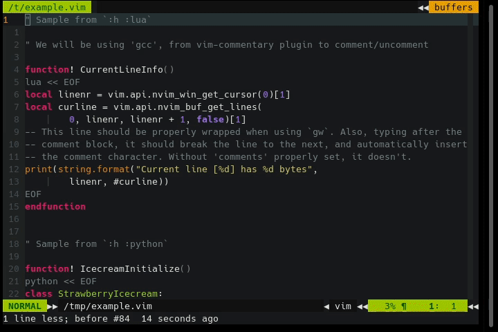

== vim-context-commentstring

This is a very simple plugin to automatically set the 'commentstring' and
'comments' Vim options in file types which contain more than one syntax (like
JavaScript nested inside HTML, or Lua nested in VimL).

It uses the names of the syntax highlighting groups to know where the cursor is,
and just set the value of those Vim settings to one appropriate for that part of
the file.

This will make Vim properly use the features, which by default are just fixed
values which are set by file type. This allows to use a plugin like
https://github.com/tpope/vim-commentary[Tim Pope's vim-commentary] to toggle the
comments, or the native Vim functionality of wrapping text when you are typing
a lines of comments.

See the documentation in the doc/context-commentstring.txt file, or browse it
online from the hosted source code in:

https://raw.github.com/suy/vim-context-commentstring/master/doc/context-commentstring.txt
